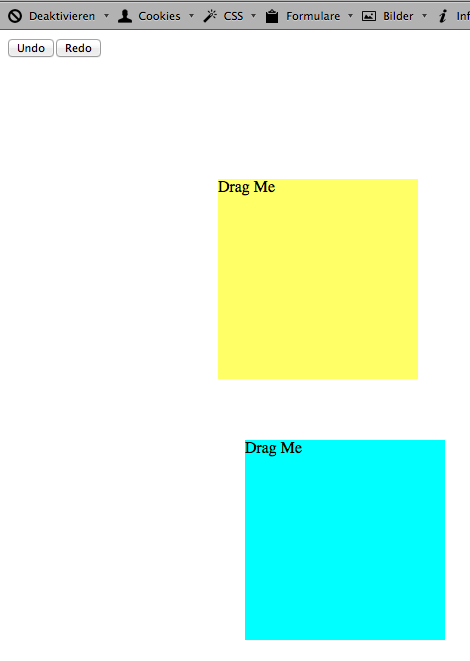

ExampleUndoManagerArthurClemens
===============================

UndoManagerArthurClemens in action.

1) Download UndoManager here
https://github.com/ArthurClemens/Javascript-Undo-Manager

2) edit path in index.html

3) Run it!

